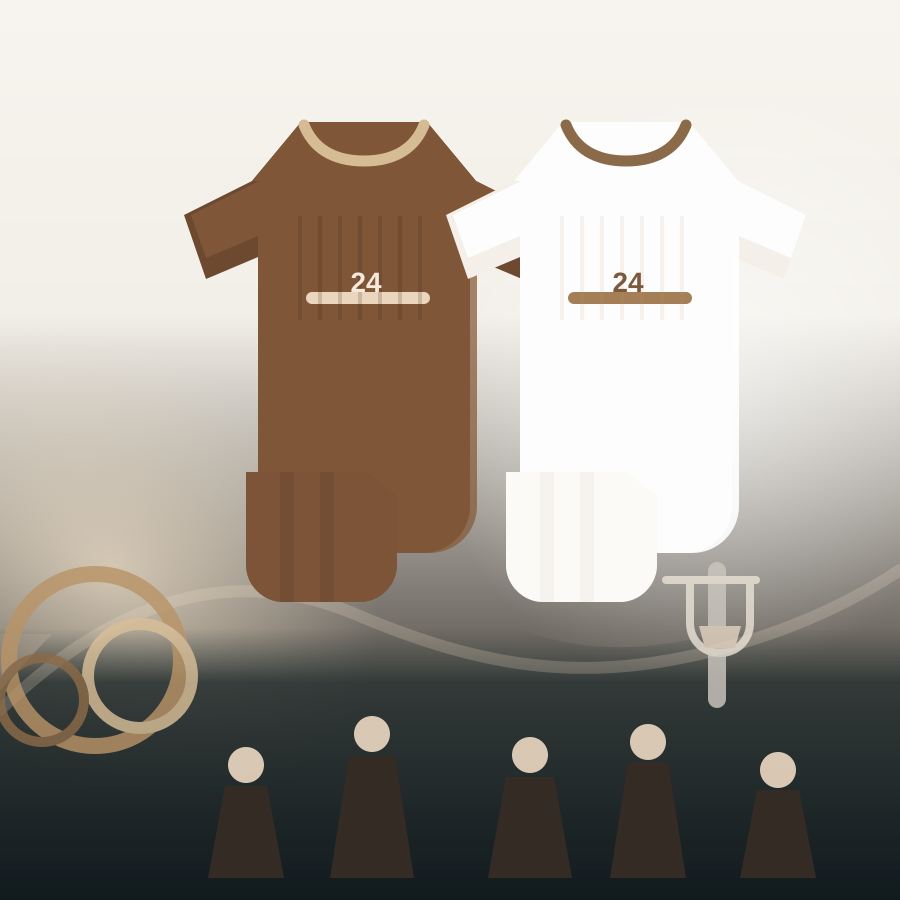

# Paradigm Website

Paradigm 是一個純靜態的品牌網站原型，使用 HTML、CSS、Vanilla JavaScript 製作。

目前網站用途：

- 品牌首頁
- 商品展示
- 商品詳情頁
- Teamwear 服務介紹
- Shopee / Instagram 等外部連結導流

這個專案沒有使用前端框架、沒有 build tool、沒有後端，也沒有購物車、結帳、會員或庫存系統。

## 本機開啟方式

進入專案資料夾：

```bash
cd /Users/gaomenghui/Documents/github/paradigm
```

啟動本機靜態伺服器：

```bash
python3 -m http.server 8000
```

然後打開瀏覽器：

```text
http://localhost:8000/
```

常用頁面：

- 首頁：`http://localhost:8000/`
- 商品列表：`http://localhost:8000/collections/`
- 商品詳情：`http://localhost:8000/products/prdm-cosmos-hoodie/`
- Teamwear：`http://localhost:8000/pages/teamwear/`
- About：`http://localhost:8000/pages/about/`

## 專案結構

```text
.
├── index.html
├── collections/
│   └── index.html
├── products/
│   └── prdm-cosmos-hoodie/
│       └── index.html
├── pages/
│   ├── about/
│   │   └── index.html
│   └── teamwear/
│       └── index.html
├── assets/
│   ├── css/
│   ├── js/
│   └── svg/
└── references/
```

## 素材與文案調整

### 商品資料

商品資料集中在：

```text
assets/js/catalog.js
```

每個商品大致長這樣：

```js
{
  slug: "prdm-cosmos-hoodie",
  title: "PRDM Cosmos Hoodie",
  category: "AW Tops",
  collection: "Core",
  price: "NT$1380",
  image: "assets/svg/hoodie.svg",
  alt: "Midnight navy hoodie placeholder artwork",
  colors: [
    { label: "Black", hex: "#111111" }
  ],
  sizes: ["M", "L", "XL"],
  shopeeUrl: "https://shopee.tw/"
}
```

常改欄位：

- `title`：商品名稱
- `category`：商品分類
- `price`：價格
- `image`：商品圖片路徑
- `alt`：圖片替代文字
- `colors`：顏色
- `sizes`：尺寸
- `description`：商品描述
- `measurements`：尺寸表
- `shopeeUrl`：Shopee 商品連結

### 商品圖片

目前 placeholder 圖片放在：

```text
assets/svg/
```

正式圖片建議另外新增資料夾：

```text
assets/images/
```

例如新增：

```text
assets/images/cosmos-hoodie-front.webp
```

然後在 `assets/js/catalog.js` 裡把商品圖片改成：

```js
image: "assets/images/cosmos-hoodie-front.webp"
```

建議圖片格式：

- 優先使用 `.webp`
- 也可以使用壓縮過的 `.jpg`
- 避免直接放過大的原始照片

### 首頁文案與主視覺

首頁內容在：

```text
index.html
```

常改區塊：

- Hero 標題
- Hero 內文
- 首頁主視覺圖片
- Collection preview 區塊文案
- Teamwear CTA 文案與連結

首頁主視覺目前類似：

```html

```

換成正式圖片時可改成：

```html

```

### Teamwear 頁面

Teamwear 頁面在：

```text
pages/teamwear/index.html
```

這個頁面常改：

- Hero 標題與說明
- Teamwear 流程文案
- 規格 / 服務內容
- FAQ
- 詢問按鈕連結

注意：因為這個頁面在 `pages/teamwear/` 裡，圖片路徑要往上兩層：

```html
../../assets/images/teamwear-hero.webp
```

### About 頁面

About 頁面在：

```text
pages/about/index.html
```

適合放：

- 品牌故事
- 品牌理念
- 聯絡方式
- 社群連結

### 社群與外部連結

Shopee、Instagram、Discord 等連結目前直接寫在各 HTML 的 footer 裡。

需要分別檢查：

```text
index.html
collections/index.html
products/prdm-cosmos-hoodie/index.html
pages/teamwear/index.html
pages/about/index.html
```

搜尋關鍵字：

```bash
rg "shopee|instagram|discord|https://" .
```

## 部署方式

這是純靜態網站，所以可以部署到 GitHub Pages、Netlify、Vercel 或任何靜態網站 hosting。

目前這個 repo 的 GitHub remote 是：

```text
git@github.com:Risetto-Kao/paradigm.git
```

如果之前已經部署過，很可能是使用 GitHub Pages。

### 使用 GitHub Pages 部署

1. 確認修改已經 commit：

```bash
git status
git add .
git commit -m "Update website content"
```

2. 推到 GitHub：

```bash
git push origin codex/reference-ui-shell
```

如果正式部署分支是 `main`，則需要把變更合併回 `main` 後推上去。

3. 到 GitHub repo：

```text
https://github.com/Risetto-Kao/paradigm
```

4. 進入：

```text
Settings → Pages
```

5. 檢查 Pages 設定：

```text
Source: Deploy from a branch
Branch: main 或目前用來部署的分支
Folder: /root
```

6. 儲存後，GitHub Pages 會重新部署。

GitHub Pages 網址通常會是：

```text
https://risetto-kao.github.io/paradigm/
```

如果已經綁定自訂網域，請以 GitHub Pages 設定頁顯示的網址為準。

### 使用 Netlify 部署

如果不想處理 GitHub Pages 路徑問題，也可以用 Netlify。

設定：

```text
Build command: 留空
Publish directory: .
```

部署方式：

1. 到 Netlify 建立新網站
2. 匯入 GitHub repo，或直接拖曳整個專案資料夾
3. 不需要 build command
4. publish directory 使用 `.`

### 使用 Vercel 部署

Vercel 也可以部署此專案。

設定：

```text
Framework Preset: Other
Build Command: 留空
Output Directory: .
Install Command: 留空
```

## 上線前檢查

部署前建議至少檢查：

- 首頁、商品列表、商品詳情、Teamwear、About 都能正常打開
- 手機寬度沒有水平捲動
- 導覽選單可以正常開關
- 商品圖片路徑正確
- Shopee 連結正確
- Instagram / Discord 等外部連結正確
- 圖片有合理的 `alt` 文字
- placeholder 文案已替換或確認可接受

## 注意事項

- 不要加入購物車、結帳、會員、庫存同步或後端功能，除非明確決定要擴充。
- 商品資料請優先維護在 `assets/js/catalog.js`，避免同一份商品資訊散落在多個 HTML。
- 正式圖片建議放在 `assets/images/`，placeholder SVG 保留在 `assets/svg/`。
- 如果未來要遷移到 Shopify，目前的 HTML/CSS 結構可再拆成 Shopify sections/snippets，但現在不需要先寫 Liquid。
