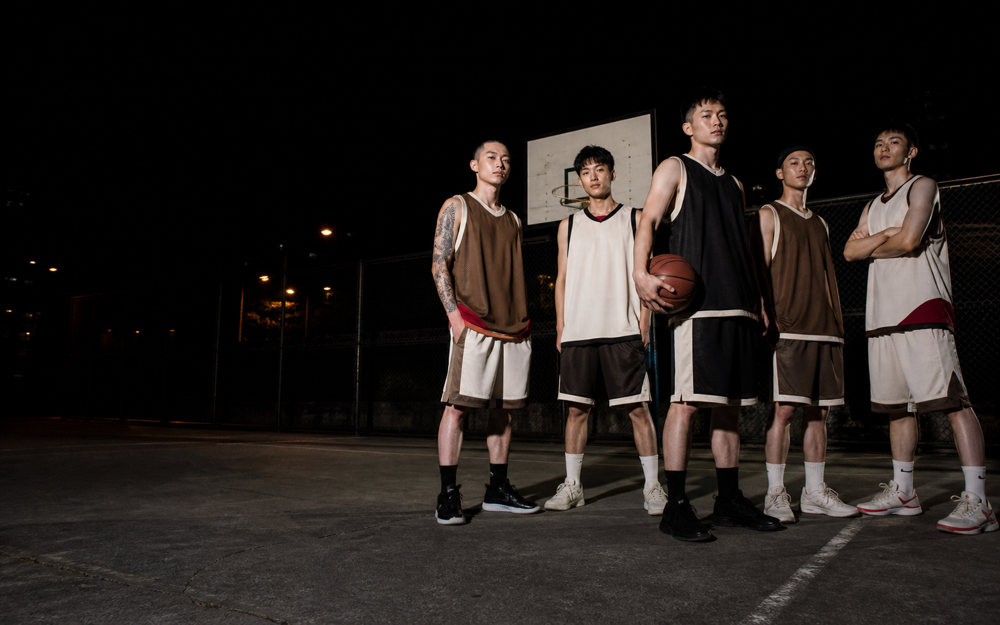
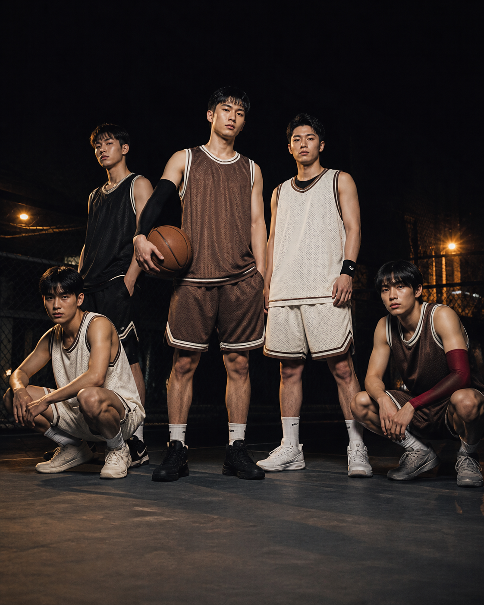
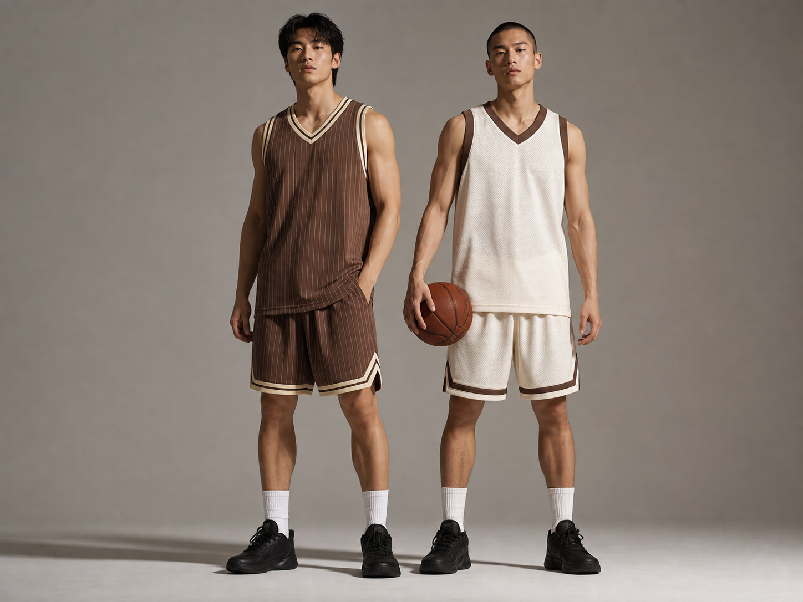
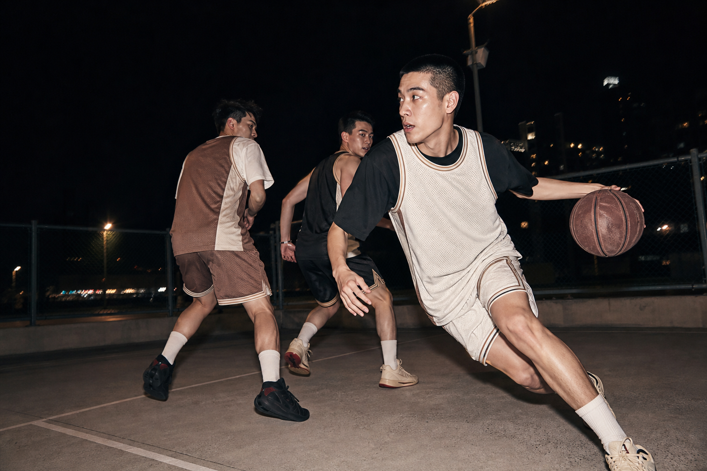
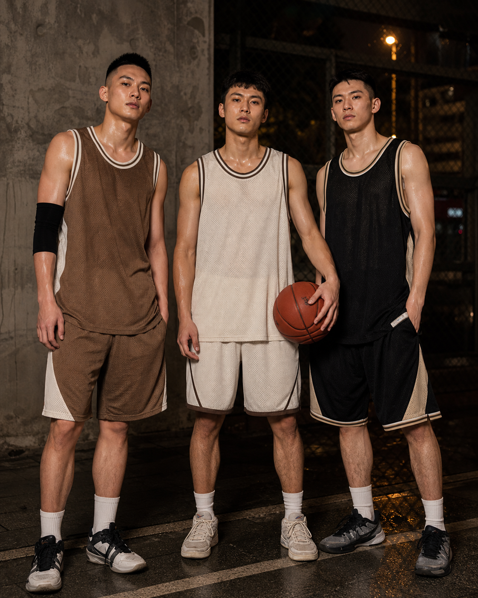
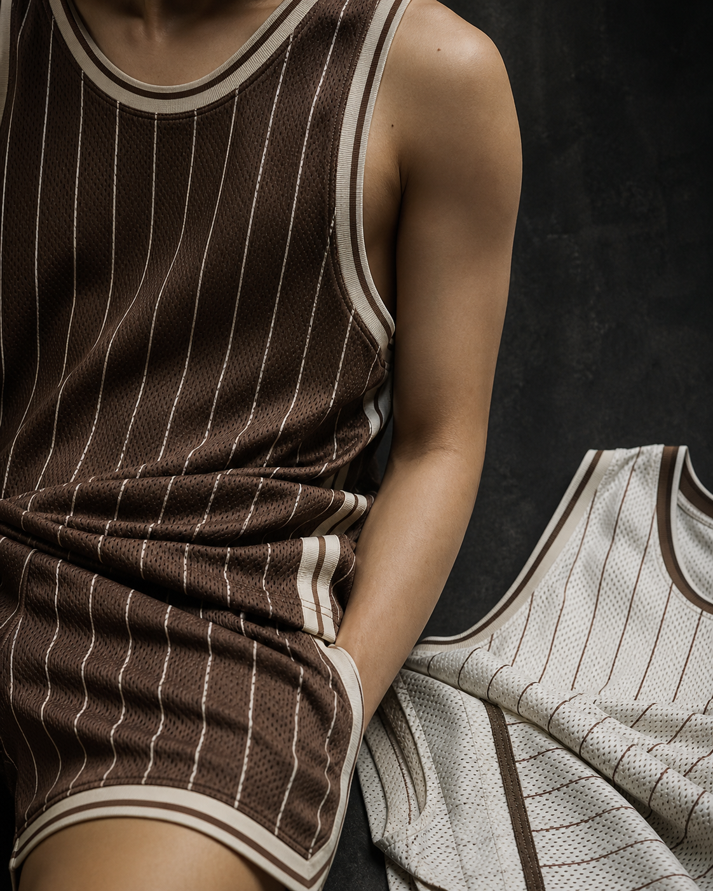
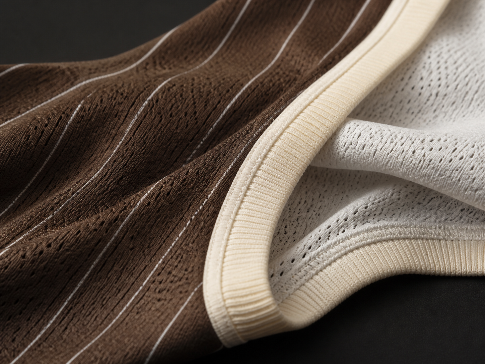
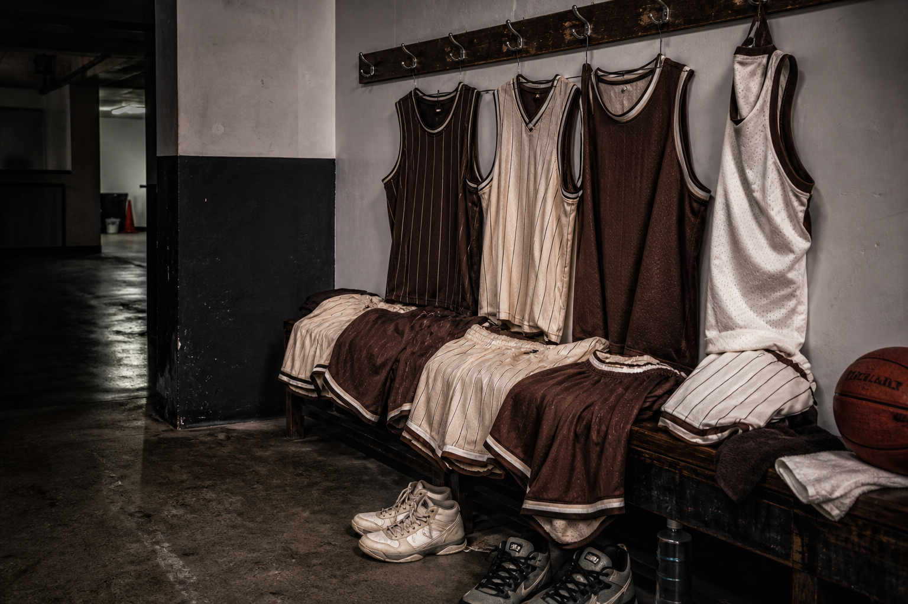

# Basketball 01 campaign photography guide

These raster images are temporary art-direction references generated with the built-in OpenAI image tool. They define crop, casting, lighting, palette, and atmosphere. They are not exact representations of the final Paradigm garment artwork.

Final photography should preserve the listed aspect ratios and copy-safe areas so the page can be updated without changing its layout. Product pattern accuracy continues to come from the supplied Essential, Classic, and Signature renders.

## 01. Hero desktop

- Web crop: `2400 × 1500`, 16:10.
- Camera: low, around knee height, with a 28–35mm documentary feel.
- Casting: five Taiwanese or East Asian young adult players; confident and unsmiling rather than aggressive.
- Composition: roster weighted to the right; keep the left half dark and quiet for the headline.
- Lighting: direct hard flash with a warm sodium rim light.
- Wardrobe: coordinated mocha, warm white, and black basketball sets with one restrained muted-red accent.
- Replace with: final five-person team campaign photograph using the real Basketball 01 artwork.

## 02. Hero mobile

- Web crop: `1350 × 1688`, 4:5.
- This is an art-directed vertical frame, not a crop of the desktop photograph.
- Keep two central players fully readable, the roster inside safe crop edges, and the lower third quiet enough for copy.
- Match the desktop lighting, wardrobe, expressions, and court location.

## 03. Reversible studio

- Web crop: `1800 × 1350`, 4:3.
- Camera: eye level, approximately 50mm.
- Composition: one complete Road look and one complete white Home look together with full bodies visible.
- Lighting: precise directional softbox with sculptural but believable shadows.
- Background: seamless warm-grey cyclorama with no props.
- Replace with: two real models wearing the same Basketball 01 set reversed to its Road and Home sides.

## 04. Campaign action

- Web crop: `1800 × 1200`, 3:2.
- Camera: low sideline position with a wide documentary lens.
- Show a real play rather than a staged dunk or celebration.
- Use direct flash to hold the uniform while allowing controlled motion blur around limbs and the court.
- Leave a quieter zone near the upper left.

## 05. Roster portrait

- Web crop: `1440 × 1800`, 4:5.
- Three players after practice, standing close with direct gaze.
- Use a concrete wall and chain-link fence rather than a studio backdrop.
- Skin, sweat, mesh, and worn shoes should remain natural and unretouched.

## 06. Garment detail

- Web crop: `1440 × 1800`, 4:5.
- Frame the neckline, armhole binding, jersey hem, shorts trim, mesh perforation, stitching, and pinstripe print together.
- No face is required; keep the crop about garment construction rather than the model.
- Pair the Road set with part of the white reverse side in the same frame.

## 07. Fabric macro

- Web crop: `1600 × 1200`, 4:3.
- Use raking side light to reveal mesh perforation, rib binding, stitches, and the smooth printed surface.
- Keep textile scale believable and avoid turning the fabric into an abstract landscape.
- Display this image no larger than approximately `480px` wide on desktop.

## 08. Customer proof locker room

- Web crop: `1536 × 1024`, 3:2.
- Camera: wide documentary frame at standing height, looking along the bench rather than directly at it.
- Composition: five coordinated Road and Home sets occupy the right two thirds; the quieter corridor and floor remain on the left.
- Lighting: direct hard flash mixed with cool fluorescent practical light.
- Set dressing: a worn basketball, used shoes, towels, hooks, and a modest urban gym locker room.
- Purpose: support the verified customer quote with a roster scale garment image instead of a small delivery snapshot.
- Replace with: a photographed post practice locker room arrangement using the real delivered Basketball 01 sets.

## Shared generation brief

Use case: `ads-marketing` for people-led campaign photography and `product-mockup` for studio garment studies.

- Photorealistic independent streetwear editorial, not an arena sports campaign or ecommerce catalog.
- Taiwanese or East Asian young adult players with anatomically correct bodies, hands, and limbs.
- Mocha brown, warm white, black, and a restrained muted-red accent.
- Believable polyester mesh jerseys and shorts with accurate seams, binding, and proportions.
- No embedded copy, readable team names, pseudo-logos, famous player numbers, watermarks, stadium spectacle, exaggerated muscles, trophies, or generic stock smiles.
- The final production photographer should replace every generated people-led image with the real uniform artwork and Paradigm-approved casting.
